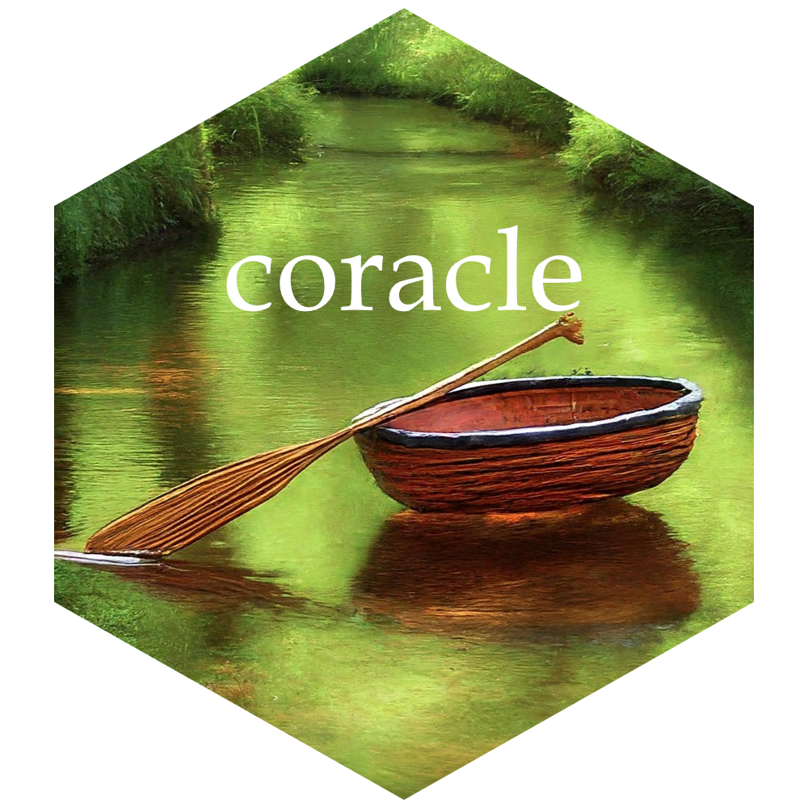

```{r, include = FALSE}
knitr::opts_chunk$set(
  collapse = TRUE,
  comment = "#>",
  fig.path = "man/figures/README-",
  out.width = "100%",
  fig.align = "center"
)
```

# coracle

{width="150"}

<!-- badges: start -->

[](https://lifecycle.r-lib.org/articles/stages.html#experimental) [](https://CRAN.R-project.org/package=coracle)

<!-- badges: end -->

Correlations of Columns for Tidy Data \>\> "Corr" & "Col" \>\> "Coracle", a type of small boat.

## Installation

You can install the development version of coracle from [GitHub](https://github.com/) with:

```{r eval=FALSE}
install.packages("devtools")
devtools::install_github("Brubaker-Lab/coracle")
```

This may fail for a variety of reasons.

## Loading

After installation, load the library with:

```{r}
library(coracle)
```

## 1.X.X

This package facilitates correlation of data through the following:

- Data handling, tree data structures, and pass-by-reference with `R6`.
- Parallelization via `furrr` and `future`

Data must be loaded into `coracle_data` objects with `coracle_data$new()` *before* it can be passed into `coracle()`. The `coracle_data` object initialization annotates, validates, and organizes the data for correlation. It requires the user to identify which column(s) of data to use for grouping, joining, and correlation.

### Preparing data with `coracle_data`

#### Creating a `coracle_data` object

A `coracle_data` object begins with a `data.frame`:

```{r}
library(tidyverse) 

df <- expand_grid(first_col = LETTERS[1:3],
                  second_col = letters[1:10]) %>%
  mutate(third_col = runif(nrow(.)))

df
```

During initialization the user will indicate:

- `grps` - The "grouping column(s)" which identify the subject of interest (i.e. microbes, drugs)
- `join` - The "joining column" which will be used to join different datasets together for correlation (i.e. genes).
- `vals` - The "values column(s)" which contains the values for correlation.

```{r}

cdo <- coracle_data$new(
  data = df,
  # Since `coracle_data` implements `tidyselect`, column(s) can be selected....
  # ... with unquoted names...
  grps = first_col,
  # ... with character vectors...
  join = "second_col", 
  # ... with tidyselect helpers...
  vals = starts_with("third")
  # ... and much more. Refer to `tidyselect` for details.
)

cdo # This is the `coracle_data` object

```

#### Basics of `coracle_data` objects

`coracle_data` objects store data in a tree structure based on the grouping column(s). The object the initialization creates is the "root node" of a tree. It doesn't actually contain any data!

```{r}
cdo$chunk # A "chunk" is the stored unit of data in a node
```
Instead, the root node contains a list of "child nodes". In this example, there are three children corresponding to the values in the data used for grouping ("A", "B", and "C").

```{r}
names(cdo$children)
```

Each child node is itself a `coracle_data` object, *almost* identical to it's parent. Let's take a closer look at one:

```{r}
cdo$children$A
```

Can you spot the differences?

Unlike the root node, in this case the children do contain data!

Data is only stored in "leaf nodes" - the nodes at the extremities of the tree - in discrete "chunks".

If we look at all three children and their chunks we can see the entire original data frame has been split in three based on the value in "first_col":

```{r}
cdo$children$A$chunk

cdo$children$B$chunk

cdo$children$C$chunk
```

We can actually retrieve the entire, original data frame using `$data`. This is how you pull data out of a `coracle_data` object.

Note: Initialization may involve transformation and renaming. When you use `$data` it will reflect those changes. All the data will be there, but not necessarily in the same format as the original.

That note doesn't apply to this example, but it's an important point to keep in mind.

```{r}

output <- cdo$data

output

```

The `coracle_data` object also contains other useful information:

```{r}
cdo$version # The version of `coracle` used to generate the object

cdo$id # A hashed id to distinguish between objects

cdo$grps_cols # List of grouping column(s)

cdo$join_col # The joining column

cdo$join_vals # The values found in the joining column

cdo$vals_col # The values column
```

That's enough to start with.

### Correlating with `coracle`

Preparing the `coracle_data` objects for `coracle` is the hardest part. Once the data is ready, it's a simple matter to call the function.

Let's create a second `coracle_data` object, this one using "X", "Y", and "Z":

```{r}
df2 <- expand_grid(df2_first = LETTERS[24:26],
                  df2_second = letters[1:10]) %>%
  mutate(df2_third = runif(nrow(.)))

df2

cdo2 <- coracle_data$new(data = df2,
                         grps = 1,
                         join = 2,
                         vals = 3)

cdo2
```

Now that we have two `coracle_data` objects, we can put them into `coracle` to do pairwise correlation and we'll get another `coracle_data` object in response. We can retrieve the data with `$data`.

```{r}

cdo_output <- coracle(cdo, cdo2)

cdo_output$data


```

